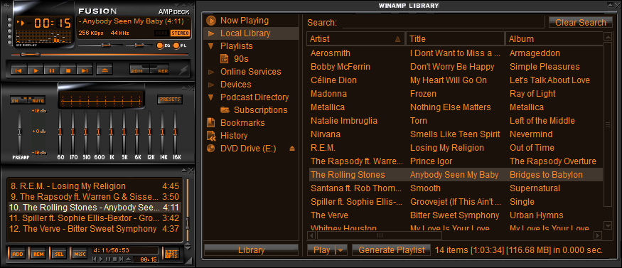
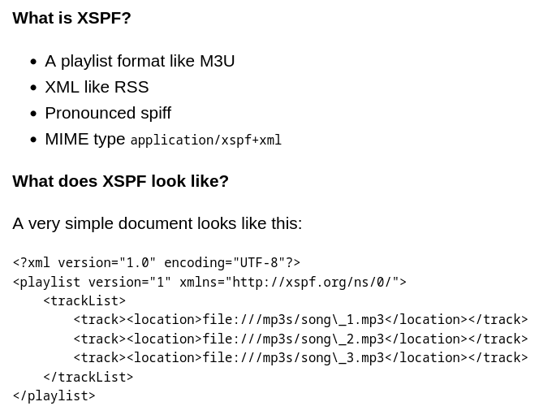
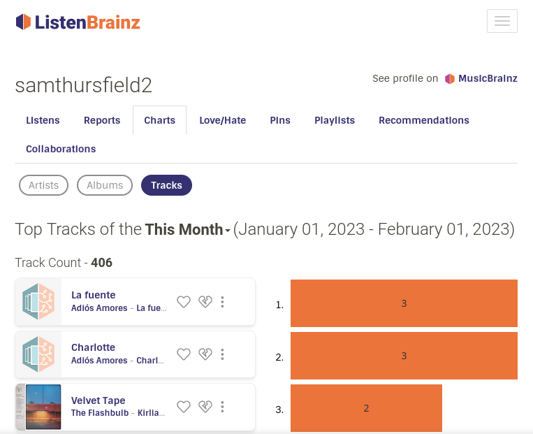
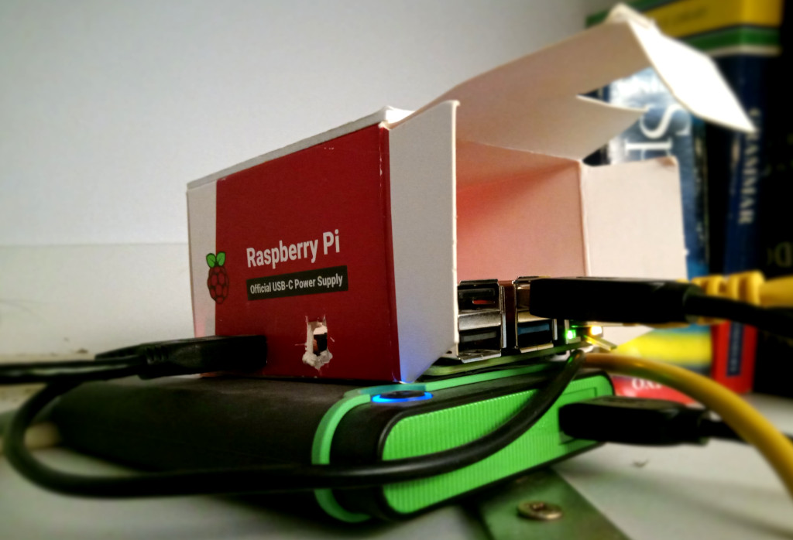
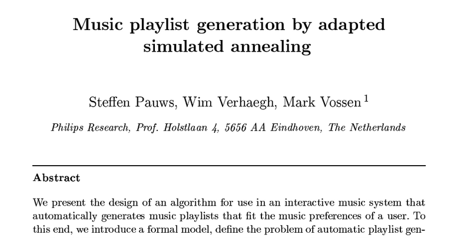
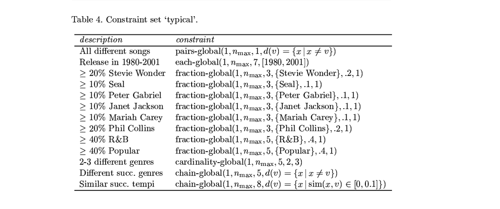
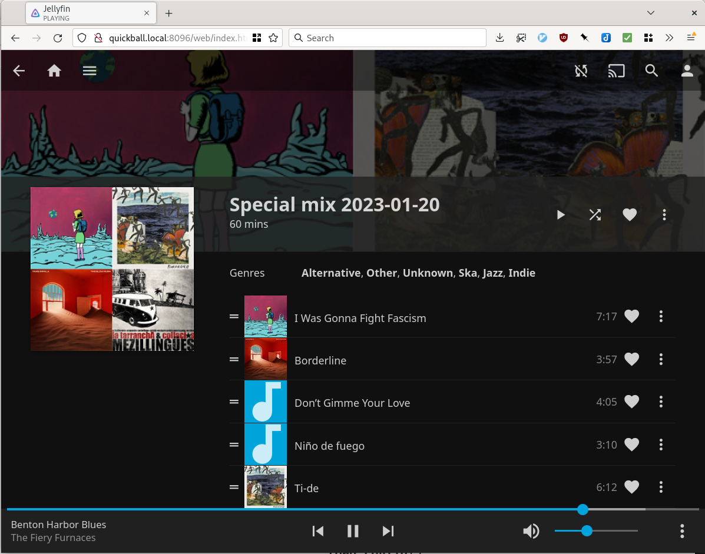

<!--
Simple, open, music recommendations with Python
FOSDEM 2023 - Python Devroom - Sunday 5/Feb 14:00
https://www.fosdem.org/2023/schedule/event/python_music_recommendation/
30 minutes inc. questions and changeover.
-->

## Simple, Open, Music Recommendations with Python

Sam Thursfield

FOSDEM 2023

???

This talk is about:

  * Philosophy
  * Coding
  * Python

---

<!-- 1. Intro / philosophy -->

## About me

<div markdown=1 class="r-stretch">
* Systems software developer @ [Codethink](https://www.codethink.co.uk/)

* Musician and music fan

* Former teacher
</div>

???

This is not a "here's some code I wrote, please use it" talk

---

## Playlists (1990s)

{:.r-stretch}

  ❌ Difficult to make

  ✅ Easy to share

Photo: <a href="https://flickr.com/photos/alamodestuff/5833382032/in/photolist-9TtBfh-ftWto-4YEr9j-ftWv6-4YAaUM-9CkP2c-wCKpk-7oFFoZ-jiRWss-Uz92kS-2msKmY4-cwMLy3-6441ZB-NhJ4YR-98j2m8-5XBbab-2ibwsrd-qdGTeD-2caMHPu-oeLk-4getqe-rgvVh-6W2MMf-9CoJsu-s6twGD-qNu6Jw-2nxVHaU-8mipwh-8A4ur-2mG5anP-2mPR2Da-2ipxnUJ-4DEj4Y-2mG3Zv4-5q6tsr-Dvs8g-2bCjKLM-2ibu6X8-mhQ1gJ-2iw3e1o-2iptJPZ-2ibwsvG-LjfuWS-9XbEbE-2mG5a2P-4YAaMR-9CoHGS-4YAaL4-qKmDBv-9kSMDW">Alamodestuff</a>, Flickr, CC-BY-NC-ND
{:.fs-6}

---

## Playlists (2000s)

{:.r-stretch}

  ✅ Easy to make

  ❌ Difficult to share

Photo: <A href="https://www.deviantart.com/ariszlo/art/Fusion-AMPdeck-5-6-556579729">Ariszlo</a>, DeviantArt, CC-BY-NC-SA
{:.fs-6}

???

xmms, rhythmbox

---

## Playlists (2010s)

{:.r-stretch}

---

## Playlists (2010s)

{:.r-stretch}

  ✅ Easy to make

  ✅ Easy to share

  🤖 Can generate the playlist for you

???

---

# Spotify philosophy {:.r-fit-text}

  * Grow as big as possible ("blitzscaling")
  * Pay artists [as little as possible](https://www.youtube.com/watch?v=MXudOLStaXA&t=11s)
  * Optimize for passive listener engagement
  * Apply user surveillance and machine-learning to every problem
  * All hail the Algorithm

???

References:

  * BJ videos
  * https://thetrichordist.com/2015/09/03/spotify-per-stream-rates-continue-to-drop-00408-more-free-users-less-money-per-stream/
  * Algorithm searches
  * ...

---

# What would the opposite look like?

---

  * Not for profit / DIY
  * Encourage building a local music collection
  * Link to artist-controlled websites
  * Work with open data

???

Bandcamp, Patreon
Musicbrainz, Listenbrainz

---

Let's get experimenting!
{:.r-fit-text}

{:.r-stretch}

---

<!-- 2. Fundamentals - open playlists -->

What can we learn from ... **Dynamicland** ?

<video src="images/dynamicland.mov" autoplay="true" muted="true"></video>

<div markdown="1" class="fs-3">
<div markdown="1" style="display:inline; vertical-align: middle;">
  * Code that fits on a sheet of A4 paper
  * Learn and participate in the process
</div>
</div>

---

What can we learn from **Git**?

{:.r-stretch}

???

Git: an incredible DIY project

---

## Git's core ideas were implemented in a month {:.r-fit-text}

<div class="left" markdown="1">
  1. Well-defined data model: blobs, trees, commits, refs.
{:.fs-3}
  2. Multi-call binary: small programs that work together
{:.fs-3}
  3. "Porcelain" and "Plumbing" layers
{:.fs-3}

Git's design allows...

  * a "polyglot" codebase
{:.fs-3}
  * easy extensions
{:.fs-3}
  * popular websites built around it
{:.fs-3}
</div>

???

C, Shell, Perl, TCL
Git LFS
Gitlab, Github
???

https://marc.info/?l=git&m=117254154130732

---

**Calliope**: the same principle for playlists.

  * Data model: everything is a playlist
  {:.fs-3}
  * Multi-call binary `cpe` (also has a Python API)
  {:.fs-3}
  * Build recommendation pipelines as shell pipelines
  {:.fs-3}
  * Optimized for ease of maintenance over ease of use.
  {:.fs-3}

```pip3 install calliope-music```
{:.fs-3}

???

There is code, but the IDEAS are what i care about ...

i.e this package won't solve all your problems

Can language-specific tools e.g. jupyter

---

## Core data model

**Playlist item**
{:.left}

```
{ "creator": "Artist 1", "title": "Great Song" }
```

<br>

**Playlist**
{:.left}

```
{ "creator": "Artist 1", "title": "Great Song" }
{ "creator": "Artist 2", "title": "Banging Tune" }
{ "creator": "Artist 3", "title": "Unpleasant Noise" }
```

This is [JSON Lines](https://jsonlines.org/) data so it can be processed one line at a time.
{:.left .fs-4}

---

# ...based on XPSF {:.r-fit-text}

{:.r-stretch}

Calliope's playlist format [is documented here.](https://calliope-music.readthedocs.io/en/latest/format.html)
{:.fs-4}

???

Use XSPF except:

 * one item per line, to allow stream-based processing for long playlists
 * JSON instead of XML


---

## Demo: playlist manipulation {:.r-fit-text}

```
{ "creator": "Artist 1", "title": "Great Song" }
{ "creator": "Artist 2", "title": "Banging Tune" }
{ "creator": "Artist 3", "title": "Unpleasant Noise" }
```

<div class="fs-3 left" markdown="1">
* Shuffle: `cpe shuffle`
* Export: `cpe export`
* Line-based shell processing
* Data-oriented shell processing
</div>

---

# What's next?

---

## Content resolution {:.top}

> XSPF is an intermediate format. We expected a new kind of software called a **content resolver** to do the job of converting XSPF to a plain old list of files or URIs.
{:.fs-3 .left .r-stretch}
>
> -- [XSPF spec](https://xspf.org/spec#34-content-resolver)
{:.fs-3 .left .r-stretch}

---

## Demo: content resolution {:.r-fit-text}

Three songs:
{:.left}

```
{"creator": "Kate Bush", "title": "Hounds of Love"}
{"creator": "Madonna", "title": "Holiday"}
{"creator": "Ana Frango Elétrico", "title": "Saudade"}
```

* Resolve locally: `cpe tracker resolve-content`
{:.left .fs-3}
* Resolve remotely: `cpe spotify resolve-content`
{:.left .fs-3}

---

# What's next?

???

We haven't recommended anything yet.

---

# Recommendations {:.r-fit-text}

big playlist ⟶ algorithm ⟶ small playlist

---

<!-- 3. Case study: special mix -->

# Case study: Special Mix {:.r-fit-text}

**Special Mix** generates a 1 hour playlist of discoveries from a specific year.
{:.left .fs-3}

`python3 -m calliope_examples.special_mix`
{:.fs-4}

<div class="left fs-3" markdown="1">
Ingredients:

  1. Listening history: [`pylistenbrainz`](https://pypi.org/project/pylistenbrainz/)
  2. Content resolution: [`beets`](https://beets.io/)
  3. Track selection: [`simpleai`](https://simpleai.readthedocs.io/en/latest/)
</div>

---

## 1. Listening history {:.r-fit-text}

<div class="r-fit-text" markdown="1">
  * Use [Listenbrainz](https://listenbrainz.org/) to track music you listen to
  * Use [Web Scrobbler](https://web-scrobbler.com/) browser extension to submit listens
  * Use [pylistenbrainz](https://github.com/metabrainz/pylistenbrainz) and `cpe listenbrainz` to access the data
</div>

{:.r-stretch}

???

Last.fm is also supported - it's an older, proprietary Listenbrainz

Spotify also tracks what you listen to - you can export the data under GDPR, but they dont' make it super easy.

---

## 1. Listening history {:.r-fit-text}

`cpe listenbrainz listens`

```
〉cpe listenbrainz-history --user samthursfield2 listens \
    | from json --objects | first 
Updating listens from Listenbrainz server  [####################################]  100%          
╭─────────────────────────────┬──────────────────────────────────────────╮
│ listenbrainz.listened_at    │ 1675368832                               │
│ listenbrainz.recording_msid │ 306525cd-74d3-4acb-b292-8bf300ba6040     │
│ listenbrainz.artist_msid    │                                          │
│ listenbrainz.release_msid   │                                          │
│ creator                     │ Knobs                                    │
│ title                       │ WIW                                      │
│ album                       │ Stipple                                  │
│ listenbrainz.origin_url     │ https://knobs.bandcamp.com/album/stipple │
╰─────────────────────────────┴──────────────────────────────────────────╯
```

???

The great thing of using Python, is *every* API has an existing Python binding

However, some are not well maintained... so we vendor them.

Syncing the data takes a while

---

## 1. Listening history {:.r-fit-text}

```
〉cpe listenbrainz-history --no-sync --user samthursfield2 \
     histogram --bucket year | from json  | last 5
╭───┬─────────────────────┬───────╮
│ # │       bucket        │ count │
├───┼─────────────────────┼───────┤
│ 0 │ 2019-01-01 00:00:00 │  6014 │
│ 1 │ 2020-01-01 00:00:00 │  5990 │
│ 2 │ 2021-01-01 00:00:00 │  4239 │
│ 3 │ 2022-01-01 00:00:00 │  6721 │
│ 4 │ 2023-01-01 00:00:00 │   208 │
╰───┴─────────────────────┴───────╯
```

...choose a year, select by `first_listen_date`: now we have a **playlist**
{:.r-fit-text}

???

---

## 2. Content resolution {:.r-fit-text}

{:.r-stretch}

---

## 2. Content resolution {:.r-fit-text}

<a href="https://www.beets.io">**Beets**</a> is the media library management system for obsessive music geeks.
{:.r-fit-text}

<div class="r-stretch">
<div style="font-family: Arial; font-size: 14px;"><pre>&gt; <b>beet</b>&nbsp;<font color="#0AAEB3">import</font>&nbsp;<font color="#0AAEB3"><u style="text-decoration-style:single">CD</u></font><font color="#FED06E"><u style="text-decoration-style:single"><b>\ </b></u></font><font color="#0AAEB3"><u style="text-decoration-style:single">Recopilatorio/</u></font>&nbsp;<font color="#0AAEB3"><u style="text-decoration-style:single">The</u></font><font color="#FED06E"><u style="text-decoration-style:single"><b>\ </b></u></font><font color="#0AAEB3"><u style="text-decoration-style:single">Autonomads</u></font><font color="#FED06E"><u style="text-decoration-style:single"><b>\ </b></u></font><font color="#0AAEB3"><u style="text-decoration-style:single">-</u></font><font color="#FED06E"><u style="text-decoration-style:single"><b>\ </b></u></font><font color="#0AAEB3"><u style="text-decoration-style:single">2009</u></font><font color="#FED06E"><u style="text-decoration-style:single"><b>\ </b></u></font><font color="#0AAEB3"><u style="text-decoration-style:single">-</u></font><font color="#FED06E"><u style="text-decoration-style:single"><b>\ </b></u></font><font color="#0AAEB3"><u style="text-decoration-style:single">No</u></font><font color="#FED06E"><u style="text-decoration-style:single"><b>\ </b></u></font><font color="#0AAEB3"><u style="text-decoration-style:single">Mans</u></font><font color="#FED06E"><u style="text-decoration-style:single"><b>\ </b></u></font><font color="#0AAEB3"><u style="text-decoration-style:single">Land/</u></font>&nbsp;<font color="#0AAEB3"><u style="text-decoration-style:single">the</u></font><font color="#FED06E"><u style="text-decoration-style:single"><b>\ </b></u></font><font color="#0AAEB3"><u style="text-decoration-style:single">autonomads</u></font><font color="#FED06E"><u style="text-decoration-style:single"><b>\ </b></u></font><font color="#0AAEB3"><u style="text-decoration-style:single">+</u></font><font color="#FED06E"><u style="text-decoration-style:single"><b>\ </b></u></font><font color="#0AAEB3"><u style="text-decoration-style:single">black</u></font><font color="#FED06E"><u style="text-decoration-style:single"><b>\ </b></u></font><font color="#0AAEB3"><u style="text-decoration-style:single">star</u></font><font color="#FED06E"><u style="text-decoration-style:single"><b>\ </b></u></font><font color="#0AAEB3"><u style="text-decoration-style:single">dub</u></font><font color="#FED06E"><u style="text-decoration-style:single"><b>\ </b></u></font><font color="#0AAEB3"><u style="text-decoration-style:single">collective/</u></font>

/home/sam/Music/The Autonomads - 2009 - No Mans Land (9 items)
Correcting tags from:
&nbsp; &nbsp; <font color="#FF3128"><b>The </b></font>Autonomads - No Mans Land
To:
&nbsp; &nbsp; Autonomads - No Mans Land
URL:
&nbsp; &nbsp; https://musicbrainz.org/release/58350fe5-4a9d-48fe-9fbd-434378b1728f
(Similarity: <font color="#519F50"><b>97.8%</b></font>) <font color="#FBB829"><b>(tracks, artist)</b></font>&nbsp;<font color="#918175">(Digital Media, 2012, GB, [none])</font>
&nbsp;* Foot <font color="#918175">I</font>n Mouth &nbsp; &nbsp; &nbsp; &nbsp; &nbsp; -&gt; Foot <font color="#918175">i</font>n Mouth
&nbsp;* Dubbin' Up <font color="#918175">T</font>he Downfall -&gt; Dubbin' Up <font color="#918175">t</font>he Downfall
&nbsp;* Back <font color="#918175">T</font>o <font color="#918175">T</font>he Bark &nbsp; &nbsp; &nbsp; &nbsp;-&gt; Back <font color="#918175">t</font>o <font color="#918175">t</font>he Bark
&nbsp;* <font color="#FF3128"><b>R</b></font>o<font color="#FF3128"><b>lling</b></font>&nbsp; &nbsp; &nbsp; &nbsp; &nbsp; &nbsp; &nbsp; &nbsp; &nbsp;-&gt; <font color="#FF3128"><b>M</b></font>o<font color="#FF3128"><b>tordread</b></font>&nbsp;<font color="#FBB829"><b>(title)</b></font>
</pre><br></div>
</div>

(I resolve content with `cpe tracker` due to [issue 107](https://gitlab.com/samthursfield/calliope/-/issues/107))
{:.fs-6}

Content resolvers are pluggable and Special Mix can use any...
{:.fs-3}

...now we have a playlist **with track URLs and durations**.
{:.fs-3}

???

Tracker is an indexer used by GNOME, it's out of scope of this talk but an easy way to index large music collection.

Content resolvers are 'pluggable':

```
def available_content_resolvers() -> List[ContentResolver]:
    """List of available classes supporting a `resolve_content` method.

    The list is:

      * :class:`calliope.spotify.SpotifyContext`
      * :class:`calliope.tracker.TrackerClient`

    """
    result = dict()
    if _module_is_available(spotify):
        result["spotify"] = spotify.SpotifyContext
    if _module_is_available(tracker):
        result["tracker"] = tracker.TrackerClient
    return result
```

---

## 3. Track selection

<div class="fs-3 left" markdown="1">
The `cpe select` module wraps the Python `simpleai` package.

You define **constraints** for the playlist, then run a **local search**
algorithm to try and find a suitable combination of tracks.
</div>

{:.r-stretch}

No neural network required.
{:.fs-3}
---

## 3. Track selection

{:.r-stretch}

Pauws, Steffen & Verhaegh, Wim & Vossen, Mark. (2008). [Music playlist generation by adapted simulated annealing](https://www.researchgate.net/publication/223327847_Music_playlist_generation_by_adapted_simulated_annealing). Information Sciences. 178. 647-662. 
{:.fs-6}

???

---

## 3. Track selection

{:.r-stretch}

<div class="fs-3" markdown="1">
Each constraint defines a *function* to score a playlist from 0 to 1.

`cpe select` searches for the playlist with the highest score given the constraints.
</div>

???

---

Using **local search** to find a solution

<div class="fs-3 left" markdown="1">
Example:

  * All songs must be 2 to 4 minutes long.
  * The playlist must be 10 minutes long.
  </div>


---

<pre class="code-wrapper">
<code class="python r-stretch fs-5">from simpleai.search.viewers import ConsoleViewer, WebViewer
from calliope.playlist import Playlist, PlaylistItem
from calliope.select import ItemDurationConstraint, PlaylistDurationConstraint
import calliope.playlist, calliope.select, calliope.shuffle
import sys
MINUTES = 60

constraints = [
    ItemDurationConstraint(vmin=2 * MINUTES,vmax=4 * MINUTES),
    PlaylistDurationConstraint(vmin=10 * MINUTES,vmax=10 * MINUTES),
]

corpus = Playlist([
    PlaylistItem({"calliope.id": "👸", "title": "Amazing Tune", "duration": 2 * MINUTES}),
    PlaylistItem({"calliope.id": "🎸", "title": "Punk Classic", "duration": 1 * MINUTES}),
    PlaylistItem({"calliope.id": "♬", "title": "Lengthy Opus", "duration": 12 * MINUTES}),
    PlaylistItem({"calliope.id": "🌄", "title": "Ambient Noise", "duration": 7 * MINUTES}),
])

viewer = WebViewer()
input_playlist = calliope.shuffle.shuffle(corpus)
output_playlist = calliope.select.select(input_playlist, constraints, viewer=viewer)

calliope.playlist.write(output_playlist, sys.stdout)
sys.stderr.write(f"Total duration: {sum(item['duration'] for item in output_playlist)}\n")
</code>
</pre>

---

## Export to music player {:.r-fit-text}

```
> head 'Special mix 2023-01-20.m3u'
#EXTM3U
#PLAYLIST:Discoveries of 2020
../../Music/Soccer96 - Tactics EP [2020]/01 I Was Gonna Fight Fascism.mp3
../../Music/Tame Impala - The Slow Rush [2020]/03 Borderline.mp3
../../Music/Vic Ruggiero - On the Ragtime [2009]/09 Don’t Gimme Your Love.mp3
../../Music/Echte Übersee Records_ Finest Latino Ska and Punk From the Americas [2002]/12 Niño de fuego.mp3
../../Music/KOKOROKO - KOKOROKO [2019]/02 Ti-de.mp3
```

<div class="fs-4" markdown="1">
```
> head 'Special mix 2023-01-20.m3u.log'
DEBUG:calliope.config:Reading config from /home/pi/.config/calliope/calliope.conf
INFO:root:Using history provider: 'listenbrainz_history'
INFO:root:Using resolver: 'tracker'
DEBUG:root:<class 'calliope_examples.special_mix.special_mix.DiscoveredInTimePeriod'>.setup()
DEBUG:root:Choose one period from: ['2005-01-01 00:00:00', '2006-01-01 00:00:00', '2007-01-01 00:00:00', '2008-01-01 00:00:00', '2009-01-01 00:00:00', '2010-01-01 00:00:00', '2011-01-01 00:00:00', '2012-01-01 00:00:00', '2013-01-01 00:00:00', '2014-01-01 00:00:00', '2015-01-01 00:00:00', '2016-01-01 00:00:00', '2017-01-01 00:00:00', '2018-01-01 00:00:00', '2019-01-01 00:00:00', '2020-01-01 00:00:00', '2021-01-01 00:00:00', '2022-01-01 00:00:00']
INFO:root:Query tracks for period 2020-01-01 00:00:00 -> 2021-01-01 00:00:00
DEBUG:calliope.listenbrainz.listens:SQL: 
              WITH
                  listens_with_track_id AS (
                      SELECT (artist_name || ',' || track_name) AS track_id, *
```
</div>


---

## Export to music player {:.r-fit-text}

{:.r-stretch}

---

# Recap: Special Mix {:.r-fit-text}

`python3 -m calliope_examples.special_mix`
{:.fs-4}

<div class="left fs-3" markdown="1">
Ingredients:

  1. Listening history: `pylistenbrainz`
  2. Local music collection: `beets`
  3. Track selection: `simpleai`
</div>

---

# What's next?

???

 * Use in teaching
 * Musicbrainz popup app
 * GUI apps
 * Websites

---

# Discussion {:.r-fit-text}

<div class="left fs-3" markdown="1">
Project:

  * Code: <https://gitlab.com/samthursfield/calliope>
  * Package: `pip install calliope-music`
  * Documentation: <https://calliope-music.readthedocs.io>

Forums:

  * Beets forum: ["Calliope - antisocial music recommendations"](https://discourse.beets.io/t/calliope-antisocial-music-recommendations/1532/29)
  * Metabrainz forum: ["Commandline tool for working with Listenbrainz data"](https://community.metabrainz.org/t/commandline-tool-for-working-with-listenbrainz-data/572368)

*Keep it simple!*
</div>

???

Use the code if you like,

but it's the ideas that are important.
