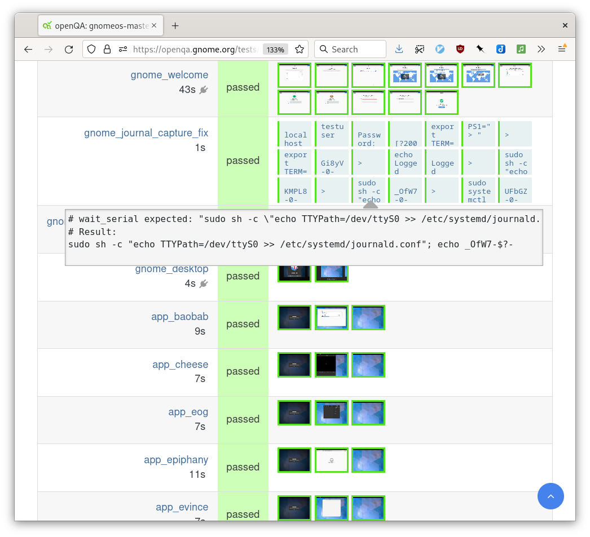

<!--
OpenQA testing for GNOME
FOSDEM 2023 - Testing and Automation Devroom - Sunday 5/Feb 11:00
https://fosdem.org/2023/schedule/event/openqa_for_gnome/
25 minutes inc. questions and changeover.
-->

# Setting up OpenQA testing for GNOME

<div class="r-stretch"></div>

<div>
  <div class="flex-row-stretch">
    <div class='flex-col left' style="flex: 1;">
  	 <p class="left">Sam Thursfield</p>
  	    <p class="left">FOSDEM 2023</p>
    </div>

    
  </div>
</div>

---

<!-- 1. About me / about GNOME -->

## About me

<div markdown=1 class="r-stretch">
  * ~20 years involved in GNOME
  * ~10 years involved in Codethink


</div>

---

## About GNOME

GNOME is a graphical desktop environment with an open development model.


---

## GNOME is older than ...

<div class="flex-row-stretch">
<div>
 (2000)<br>
</div>
<div>
 (2004)<br>
</div>
<div>
 (2005)<br>
</div>
<div>
 (2005)<br>
</div>
</div>

<!--  * Billie Eilish (2001)
  * Myspace (2003)
  * Greta Thunberg (2003)
  * Codethink (2008)
  * some of its contributors
-->

---

<!-- 2. Why is GNOME hard to test? -->

<h2 class="r-fit-text">GNOME is hard to test</h2>

 * Designed as a whole
 * Released as a kit of parts (200+ modules)


???

Also - cruft
Also - inconsistent investment around upstream testing, volunteers not super interested in testing

---

<h2 class="r-fit-text">Why is GNOME hard to test?</h2>

Who is responsible for integration testing?
{:.fs-3}

[](https://mermaid.live/edit#pako:eNqtlF1vmzAUhv-K5d4CSmyTApMmbcp2tWpT290s5OIEDgGVr9lGaxblv88G2gwl7VqtRqDD4Xlfm8PBe5o0KdKIbiW0OflyHdfEjCWqYlvfIlSrISQ2XhPXHW6V674nV03alXgFRa3NiXK-GjLkmFr_hx17Wzv-tnZi5XmeMbCHNTkphpHfgtxAWVr5NZYICvtJxniY5byaPak-z_NX8uIZflD8lTqyfSWWhdKyYasPMsnJN0juYItSrV8mm5sSbwqoXy3kj_XuP9lgZsivN5b5rmz72ev6aYCdAmwC8H8B4hTgE8CfrLL3JK73sdsSiW0jteud-2-OtG_ozwi6k2gUPztUg-TYokPHWUVSglJLzEiKGXSlJllRltFF1g_Hru0OowvO-Ri7v4pU5xFr799N5K1sElTq5fKHRAoqBylhFxFB-NQU2nY0TAVmweb59ZBxUIdWKCsoUrMj7a1hTHWOFcY0MuH4ojGN64NBuzYFjZ_SQjeSRhmUCh0KnW5udnVCIy07fICWBZgNrnqkWqhptKf3NJpz3wuChc9mPPAvBWMO3dls6C38meALMZvzxSU7OPR30xiDmaF9Fgoe-qFgQRj6vduP_qGd8vAHlyjAVw)


???

(Note! Many important teams aren't listed)
No "BDFL".
Ref: conway's law
Unit tests are easy

Open (public) development: various corps. and volunteers collaborate in the open

e.g. a change in gnome-control-centre, which depends on a change in systemd... which is not even in gnome, nor on all target OSes

---

<!-- 3. Integration testing 1999 -->


## Testing GNOME releases - 1999 style {:.r-fit-text}

<div class="left fs-3" markdown="1">
*Maintainers*:

```bash
make test
sudo make install

make dist
```

*Release team*: "It builds... ship it!"

*Distros*: "It's released - ship it!"

*Users*: Time to test if anything works...

**Minimal integration testing, and many bugs introduced at integration time**.

> "This feature only works if you pass `--enable-ibus` at configure time..."
{:.fs-5}

</div>

<!-- 4. 23 years of improvements -->

---
### Time passes

Build tools improve...

 * jhbuild
 * Meson
 * BuildStream

---

### Time passes

Collaboration tools improve

  * Git
  * Gitlab

CI is easy to setup for the first time.

???

https://about.gitlab.com/blog/2020/09/08/gnome-follow-up/

"Another noticeable difference in the community is that, since moving to GitLab, there is more awareness around what CI/CD is and how important it is to the development process. CI/CD is being used extensively throughout the project."

---
## Testing GNOME releases - 2022 style {:.r-fit-text}

<div class="left fs-4" markdown="1">
*Maintainers*:

  * Review MR's, run automated tests, merge to 'master'
  * Update gnome-build-meta integration repo (usually)
  * Release tarballs

*Release team*:

  * Check full builds in gnome-build-meta CI
  * Publish tarballs

*Distros*:

  * Downstream regression testing (unit + integration tests)
  * Beta releases

*Users*:

  * Bug reports
  * Friendly messages thanking volunteers for their hard work
</div>

---
## The "Testable" initiative

Started around 2012 and brought us...

  * OSTree
  * GNOME Continuous
  * gnome-build-meta
  * GNOME OS

---
# GNOME OS
<div class="left fs-3" markdown="1">

**Goals**:

  * Provide a "known good" full system integration
  * Allow designers and developers to test in-progress changes in a real system
  * Automated regression testing

**Non-goals**:

  * Reliability
  * Security updates, hardware enablement, user support

</div>
???

Idea is [10 years old](https://blogs.gnome.org/aday/2012/08/07/gnome-os/)

"Known good" is very useful when debugging to see if the issue is in GNOME itself, or downstream.

---

<!-- 5. Integration testing 2022 -->


<!-- 6. Issues with this model -->

# Remaining issues

<div class="left fs-4" markdown="1">
Only a few people test GNOME OS today

  * Building GNOME OS images takes hours
  * Easier to test "in-place" on development machine

How can we get better at catching regressions before they reach users?

</div>

???

User bug reports are nice but even with good intentions, its a lot of work to produce a useful ,actionable report.

Typical bug report: https://discourse.gnome.org/t/gnome-global-search-doesnt-find-any-files-in-my-native-language/13061/9

Result: fix compile flags for gnome-shell in Arch Linux


<!-- 7. Meanwhile downstream... -->

---

## OpenSuSE Tumbleweed {:.r-fit-text}

The first "rolling release" distro ?

Born [in 2010](http://www.h-online.com/open/news/item/openSUSE-Rolling-release-project-Tumbleweed-proposed-1146308.html), reworked heavily [in 2014](https://www.linux-magazine.com/Issues/2016/183/OpenSUSE-Tumbleweed).

Incoming packages from "Factory" put through regression testing using [OpenQA](https://open.qa/), then promoted.

???

Rolling release distro was a new idea in 2010, nobody did that.

# OpenQA

Initial commit in 2010.

Components:

  * Web interface (OpenQA)
  * Test driver (os-autoinst)
  * Test library (os-autoinst-distri-opensuse)

---

# OpenQA is used by...

 * OpenSUSE (?? tests)
 * SUSE
 * Fedora (?? tests)
 * EuroLinux (CentOS derivative)
 * Codethink (testing Linux)
 * Automotive industry (look out for QED)
 * ...

???

Who is familiar with OpenQA in the audience?

---

## OpenQA: main page

<!--.stretch[] -->


---

<!-- 8. Show and tell: viewing the tests -->

## Gitlab: gnome-build-meta

{:.r-stretch}

???

GNOME release team's integration repo

"What repos and commits correspond to release X.Y of GNOME ?"

Lots of work done in CI pipelines. Two beefy donated servers (x86_64, ARM) run builds.

## Gitlab: gnome-build-meta wiki

{:.r-stretch}

## Gitlab: CI pipelines

{:.r-stretch}

## Gitlab: s3-image

{:.r-stretch}

???

This job creates an installer ISO and uploads it to Amazon S3 file storage.

## Gitlab: test-s3-image

{:.r-stretch}

???

This job runs the OpenQA tests

## Gitlab: test-s3-image

{:.r-stretch}

???

## Gitlab: test-s3-image

This job:{:.r-stretch}

 * runs using the upstream 'openqa-worker' Docker image
 * downloads the ISO from S3
 * creates a temporary, unique 'machine' and connects it to OpenQA
 * submits a test job to OpenQA, tagging it with the unique machine ID
 * starts the 'run_worker' script in bg, and waits for the job
 * polls job status report until its passed/failed
 * job runs, against the locally downloaded ISO, and passes or fails
 * removes the machine again and pipeline exists

???

The runner *is* the worker - not a dedicated machine. (less infra to maintain- we already have this beefy server set up as a Gitlab runner, with sufficient privs to do KVM inside Docker).

<!-- 9. Show and tell: viewing the tests -->

---

## OpenQA: Test results

{:.r-stretch}

???

Each of these tests on the LHS corresponds to a Perl script in 'openqa_tests.git' repo.

--

## OpenQA: Test results

{:.r-stretch}

---

## OpenQA: gnome\_install test

{:.r-stretch}

???

What you see in the web UI are the screenshot comparisons ('needles')

Behind the scenes are test scripts written in Perl. We'll look at those later.

Helper functions provided by OpenQA to:

  * do screenshot ('needle') comparisons
  * send keypresses and mouse click events to QEMU display (over VNC)
  * needle can have 'click' areas to make this easier

---

## OpenQA: gnome\_welcome test

{:.r-stretch}

???

First time we can log in (no root password)

---

## OpenQA: gnome\_journal\_capture\_fix test

{:.r-stretch}

???

Several ways to run commands - serial console is least extra work.

---

## OpenQA: gnome\_desktop test

{:.r-stretch}

???

Exclusion match: ignore version number.

Design changes: all needles with tag 'gnome_desktop_tour' are tried, and if any matches, test passes. So it tests against all old and new versions of the design. (You can remove old needles if you want).

---

## OpenQA: gnome\_system\_monitor test

{:.r-stretch}

???

Exclusion match: window body.

<!-- 10. Show and tell - needle editor -->

---

## OpenQA: needle editor

{:.r-stretch}

---

## OpenQA: needle editor 2

{:.r-stretch}

<!-- 11. Show and tell - openqa-needles and openqa-tests repos -->

---

## OpenQA: openqa-needles Git repo

{:.r-stretch}

???

All in one repo

Multiple versions of the product with design differences:

  * test everything against everything

Repo gets very big... no solution really.

---

## OpenQA: a needle

<div class="flex-row-stretch" display="flex:1;" markdown="1">
<div markdown="1" style="width: 18em;">
```json
{
  "area": [
    {
      "xpos": 31,
      "ypos": 78,
      "width": 959,
      "height": 599,
      "type": "match"
    }
  ],
  "properties": [],
  "tags": [
    "app_baobab_home"
  ]
}
```
</div>
<div markdown="1">
{:width=75%}
</div>
</div>

<!-- 11. Show and tell - openqa-tests and openqa-needles repos -->

---

## openqa-tests.git

{:.r-stretch}

???

Everything is Perl.

Python is supported in theory, i didn't get it to work, and it involves a Perl->Python bridge so additional complexity that might be unhelpful.

---

## openqa-tests/main.pm

{:.r-stretch}

---

## openqa-tests/tests/gnome-install.pm

{:.r-stretch}

---

## openqa-tests/tests/gnome-welcome.pm

{:.r-stretch}

---

<!-- 12. OpenQA tips and tricks -->

## Tips and Tricks

<div markdown="1" class="fs-3">

1. OpenQA is great!  ❤️  Use it!

2. Explore the test library code:

    * [testapi docs](http://open.qa/api/testapi/)
    {: .fs-4 }
    * [os-autoinst-distri-opensuse](https://os-autoinst.github.io/os-autoinst-distri-opensuse/)
    {: .fs-4 }

3. Keep tests simple.

4. Always check the os-autoinst logs.

    * Example: If needle bounds are invalid, you get a log message and a confusing "0% match" in web UI
    {: .fs-4 }

5. Learn how to run the testsuite locally.

6. Take care with upstream containers - pin versions using container hash.

</div>

<!-- 13. Next steps for GNOME -->

---

## Next steps for GNOME OpenQA

1. Build a small team to maintain tests and infra.

2. Reach "production ready" state.

3. GNOME module teams maintaining & extending their own tests.

4. Add example user content (text documents, multimedia, etc)

<!-- 14. Credits -->

---

# Credits

<div class="flex-row-stretch fs-6 left top" markdown="1">
<div markdown="1" style="margin-right: 2em">
Top names from gnome-continuous and gnome-build-meta repos:

 * Abderrahim Kitouni
 * Carlos Garcia Campos
 * Colin Walters
 * Debarshi Ray
 * Dor Askayo
 * Emmmanuele Bassi
 * Giovanni Campagna
 * Iñigo Martinez
 * Jasper St. Pierre
 * Javier Jardón
 * Jeremy Bicha
 * Jordan Petridis
 </div>
<div markdown="1" style="margin: 2em">
 * Michael Catanzaro
 * Owen Taylor
 * Philip Chimento
 * Tristan Van Berkom
 * Vadim Rutkovsky
 * Valentin David

Special mentions:

 * Allan Day (blogs, documentation)
 * Andrea Veri (OpenID help)
 * James Thomas (openQA tests & QEMU help)
 * Will Thompson (Endless installer, OpenQA advice, ...)
</div>
</div>
???

2012 - Colin Walters introduces OSTree, and GNOME Continuous

https://blogs.gnome.org/aday/2012/08/07/gnome-os/

<!-- 15. How to get involved / Q & A-->

---

## How to get involved {:.r-fit-text}

<div class="left" markdown="1">

I will provide training on infra maintenance and writing tests - just ask!

  * Chat: Matrix [#gnome-os:gnome.org](https://app.element.io/#/room/#gnome-os:gnome.org) (Libera.chat #gnome-os)
  {:.fs-3}
  * Email: *sam@afuera.me.uk*
  {:.fs-3}
  * Forum: [https://discourse.gnome.org/](https://discourse.gnome.org/)
  {:.fs-3}

Also: [documentation](https://gitlab.gnome.org/GNOME/gnome-build-meta/-/wikis/openqa/OpenQA-for-GNOME-developers), [issue tracker](https://gitlab.gnome.org/GNOME/gnome-build-meta/-/wikis/openqa/OpenQA-for-GNOME-developers)
{:.fs-3}

<div>
  <div class="flex-row-stretch">
    <div class='flex-col left' style="flex: 1;">
  	 <p class="left">Sam Thursfield</p>
  	  <p class="left">FOSDEM 2023</p>
    </div>

    
  </div>
</div>
</div>
