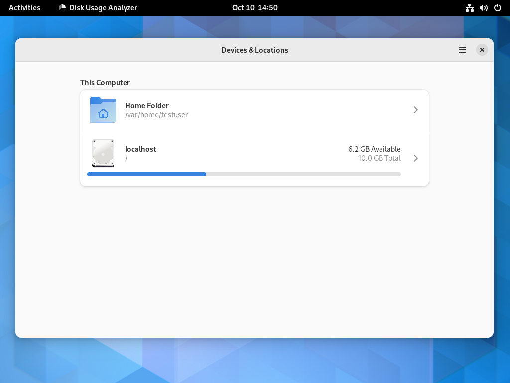

<!--
The best testing tools we've ever had
GUADEC 2023 - Thu 27th July
40 minutes incl questions

Submit slides b4 talk!!
-->

### The best testing tools we've ever had {:.r-fit-text}

An introduction to
## openQA for GNOME {:.r-fit-text}

<div class="r-stretch"></div>

<div class="flex-row-stretch" markdown="1">
  <p class="left" style="flex: 1;" markdown="1">
  **Sam Thursfield**<br>
  **GUADEC 2023**
  </p>

  {:.right style="flex: 1;"}
</div>

---

# My story

 * GNOME (2003-)
 * Codethink (2011-)
 * Desktop search (Tracker) (2011-)

???

I don't always do "about me", but it is relevant here to see why I've been pushing this recently...

Using GNOME since 2003 ([2.8](https://help.gnome.org/misc/release-notes/2.8/))

Codethink - somehow still work here - consultancy, mostly financial & automotive work now

Early projects: MeeGo - Tracker - critical bugs e.g. 100% CPU when you connect a USB stick.

No paid work on Tracker since 2012, but remained as a volunteer maintainer. Ported to Meson, set up initial Gitlab CI, in-tree "functional tests" testsuite.

---
class: invert

In 2011, GNOME had no automated testing *at all*

---

## Dreams of end to end testing

 * <span class="highlight">GUADEC 2012</span> in A Coruña:
     * GNOME Continuous; "Testable" initiative
 * <span class="highlight">GNOME OS</span> project:
     * BuildStream, Freedesktop SDK
 * openQA at <span class="highlight">SUSE</span>: since 2009
     * Now used by Fedora, Debian, and more
 * <span class="highlight">Codethink</span>: openQA testing in automotive

???

We've been working towards "integration testing of GNOME as it happens" for over a decade.

---

Open this URL in your laptop:

<https://openqa.gnome.org/>
{:.r-fit-text}

{:.r-stretch}

???

You can sign in with GNOME LDAP if you have it.

View "All tests" and select one test

Do this in browser ! Show:

  -- install: 
  --   it's creating an empty qemu VM
  --   installing GNOME OS with the latest ISO
  --   ...
  -- apps:
  --   it uses the preinstalled disk image
  -->

???

Look at:

  1. gnome_install test
  2. gnome_apps test

---
class: left

# <span class="highlight">End to end testing</span> for GNOME {:.r-fit-text}

<div class="gray-2 fs-2" markdown="1">
  * Each testsuite runs in a new virtual machine
  * Tests run against [GNOME OS](https://os.gnome.org/):
     * Latest commit of every GNOME module
     * [Freedesktop SDK](https://gitlab.com/freedesktop-sdk/freedesktop-sdk/-/tree/master/elements) base OS
  * Working since Sept. 2022, in "open beta" status
</div>

???

Notes:

  * openQA manages VM (using QEMU); hardware testing can come soon
  * distro independent - distros are doing their own integration testing (many also using openQA), but testing already-released versions of GNOME
  * using Freedesktop SDK beta OS (~modern base, & we can control version of every component)
  * max ~1hr a week to maintain, infra (only me), tests (me + Jordan)
    * you're invited to join in!

---

## Types of testing


???

Mike Cohn's "test pyramid" ("Succeeding with Agile").

  * Unit tests - easy to write; hard to test real usecases (everything outside the unit is "mocked", e.g. connect a USB stick)
  * Integration tests: everything else goes here.
      * "Functional tests", "UI tests", "service tests",...
  * I prefer "end to end testing" over "OS testing"
     * You control every aspect! Via mouse, keyboard, connect a real USB stick...
     * Good coverage of stuff which is difficult with project-specific tests: hardware support, initial setup, session management, font rendering ...
  * Test itself is fast & cheap; but *cycle time* is slow with openQA tests

---

## Use cases

  1. <span class="highlight">See "latest GNOME" 🧔</span>
  2. Update needles 🧑🏽‍🦰
  3. Diagnose & report regressions 👨🏿‍⚕️
  4. Develop new tests: 👩🏻‍🏭

---

## How to: See "latest GNOME" 🧔 {.r-fit-text}

Documentation: [Checking test results](https://gitlab.gnome.org/GNOME/gnome-build-meta/-/wikis/openqa/OpenQA-for-GNOME-developers#checking-test-results)

???

Don't go to openqa.gnome.org

Go to gnome-build-meta pipelines:

  * filter for 'master'
  * open test-s3-image
  * go to the link & see exactly the test
  * there's a corresponding link in the openQA vars directory.

Another trick:

  * you can look at stable branches too
  * look in Needles repo.

---

## Components of GNOME openQA testing {:.r-fit-text}

1. <span class="highlight">openQA</span>: optional web frontend <span class="fs-4">([openqa.gnome.org](http://openqa.gnome.org))</span>
2. <span class="highlight">isotovideo</span>: openQA test runner <span class="fs-4">(you can run this on your laptop!)</span>
3. <span class="highlight">[gnome-build-meta](https://gitlab.gnome.org/GNOME/gnome-build-meta/)</span>: integration repo
      * project CI builds GNOME OS and runs openQA tests
      {:.fs-3}
4. <span class="highlight">[openqa-tests](https://gitlab.gnome.org/GNOME/openqa-tests)</span>: tests repo
      * Defines test suites <span class="fs-4">(using Perl + [openQA test API](http://open.qa/api/testapi/))</span>
      {:.fs-3}
5. <span class="highlight">[openqa-needles](https://gitlab.gnome.org/GNOME/openqa-needles)</span>: screenshots repo

---
## Use cases

  1. See "latest GNOME" 🧔
  2. <span class="highlight">Update needles 🧑🏽‍🦰</span>
  3. Diagnose & report regressions 👨🏿‍⚕️
  4. Develop new tests: 👩🏻‍🏭
---

## How to: Update a Needle 🧑🏽‍🦰 {.r-fit-text}

Documentation: [How to update a needle](https://gitlab.gnome.org/GNOME/gnome-build-meta/-/wikis/openqa/OpenQA-for-GNOME-developers#how-to-update-a-needle)

---

## An example needle {.r-fit-text}

<div class="flex-row-stretch" display="flex:1;" style="align-items: top;" markdown="1">
<div markdown="1">
{:width=75%}
</div>
<div markdown="1" style="width: 18em;" class="fs-3">
```json
{
  "area": [
    {
      "xpos": 31,
      "ypos": 78,
      "width": 959,
      "height": 599,
      "type": "match",
      "match": 96,
    }
  ],
  "properties": [],
  "tags": [
    "app_baobab_home"
  ]
}
```
</div>
</div>

See this needle in action [here](https://openqa.gnome.org/tests/1228#step/app_baobab/2).

See also: [openQA starter guide - Basic Concepts](http://open.qa/docs/#_needles).
{:.fs-3}

---

Question: *"How many false positives do you get?"*
{:.r-fit-text .highlight}

Look at how often the needles are updated...


???

Default background
Adwaita header bar changes
Font rendering

---
Screenshot tests will always have false positives.
{:.highlight}

openQA deals with this in 4 ways:

  1. Search within the screen
  2. Similarity threshold (90-100%)
  3. Exclude zones
  4. Web UI for needle updates.

---
## Use cases

  1. See "latest GNOME" 🧔
  2. Update needles 🧑🏽‍🦰
  3. <span class="highlight">Diagnose & report regressions 👨🏿‍⚕️</span>
  4. Develop new tests: 👩🏻‍🏭
---

## How to: Diagnose & report regressions 👨🏿‍⚕️ {.r-fit-text}

Documentation: [When tests fail](https://gitlab.gnome.org/GNOME/gnome-build-meta/-/wikis/openqa/OpenQA-for-GNOME-developers#when-tests-fail)

???

What can you do? "It's broken" ... not very useful

  * Mention in #gnome-os and/or project channel
  * Check open issues (see 'Integration test failure' label)

Steps:

  * OpenQA test number
  * Gitlab pipeline number
     * You can download exactly that version of GNOME OS and reproduce the issue in GNOME Boxes
  * gnome-build-meta commit
     * Use pipeline-report script
  * Logs from serial port.

It's important not be annoying

Example: real test failures!

---

Question: *"how many real bugs has openQA caught?"*
{:.r-fit-text .highlight}

Let's see Gitlab label: [9. End-to-end test failure](https://gitlab.gnome.org/groups/GNOME/-/issues/?sort=created_date&state=opened&label_name%5B%5D=9.%20End-to-end%20test%20failure&first_page_size=20)

???

It's very hard to be sure, but some examples:

  ...

---
## Use cases

  1. See "latest GNOME" 🧔
  2. Update needles 🧑🏽‍🦰
  3. Diagnose & report regressions 👨🏿‍⚕️
  4. <span class="highlight">Develop new tests: 👩🏻‍🏭</span>
---

## How to: Develop new tests 👩🏻‍🏭 {:.r-fit-text}

Documentation: [Adding more tests](https://gitlab.gnome.org/GNOME/gnome-build-meta/-/wikis/openqa/OpenQA-for-GNOME-developers#adding-more-tests)

---
class: left

## How your test controls the VM {:.r-fit-text}

1) Trigger an action:

<div class="fs-3 gray-2" markdown="1">
  * Type on keyboard - [`send_key`](http://open.qa/api/testapi/#_send_key), [`type_string`](http://open.qa/api/testapi/#_type_string)
  * Click with mouse - [`mouse_set`](http://open.qa/api/testapi/#_mouse_click),[`assert_and_click`](http://open.qa/api/testapi/#_click_lastmatch)
  * Run command on serial console - [`assert_script_run`](http://open.qa/api/testapi/#_assert_script_run)
  * Other stuff: [`power`](http://open.qa/api/testapi/#_power), [`switch_network`](http://open.qa/api/testapi/#_switch_network), ...
</div>

2) Assert that the correct thing happened

<div class="fs-3 gray-2" markdown="1">
  * Await needle (screenshot) match - [`assert_screen`](http://open.qa/api/testapi/#_assert_screen)
  * Other stuff - [`upload_asset`](http://open.qa/api/testapi/#_upload_asset), [`assert_recorded_sound`](http://open.qa/api/testapi/#_assert_recorded_sound), ...
</div>

Example: [app_nautilus.pm](https://gitlab.gnome.org/GNOME/openqa-tests/-/blob/master/tests/app_nautilus.pm)

---

## Running tests locally

Documentation: [Running the test suite locally](https://gitlab.gnome.org/GNOME/gnome-build-meta/-/wikis/openqa/OpenQA-for-GNOME-developers#running-the-test-suite-locally)

Helper tool: [ssam_openqa](https://gitlab.gnome.org/sthursfield/ssam_openqa/)

???

You can run the tests on your laptop

You are not limited to screenshot testing.

Tests are Perl programs & can run arbitrary code. openQA is not only for screenshot tests.

But it has special helpers for screenshot testing. We'll go more into how that works.


---

Question: *How much effort is it to maintain?*
{:.r-fit-text .highlight}

{:.r-stretch}

Source: <https://gitlab.gnome.org/GNOME/openqa-tests/-/issues/9>
{:.fs-4}

---

## What's next?

<div class="left fs-2" markdown="1">
**It's up to you!** Any of these things may or may not happen...

  * Tests for core app features, [Shell](https://gitlab.gnome.org/GNOME/openqa-tests/-/issues/34), [locales](https://gitlab.gnome.org/GNOME/openqa-tests/-/issues/22), [accessibility](https://gitlab.gnome.org/GNOME/openqa-tests/-/issues/23), [search + content apps](https://gitlab.gnome.org/GNOME/openqa-tests/-/issues/8)
  * [Pre-merge testing](https://gitlab.gnome.org/GNOME/gnome-build-meta/-/issues/601) for gnome-build-meta
  * Tests on real hardware and performance measurement
  * Tests for [specific GNOME releases](https://gitlab.gnome.org/GNOME/openqa-tests/-/issues/21)
  * [Testing beyond gnome-build-meta](https://gitlab.gnome.org/GNOME/openqa-tests/-/issues/38) (e.g. 3rd party apps)
  * A culture of end-to-end testing and higher quality releases.
</div>

---
class: left
## How to get involved {:.r-fit-text}
<div class="fs-3" markdown="1">
Help welcome from GNOME maintainers and **everyone else**!

I will provide training on infra maintenance and writing tests - just ask.
{:.highlight .r-fit-text}

  * Chat: Matrix [#gnome-os:gnome.org](https://app.element.io/#/room/#gnome-os:gnome.org)
  {:.fs-3}
  * Forum: [https://discourse.gnome.org/](https://discourse.gnome.org/)
  {:.fs-3}
  * Email: *sam@afuera.me.uk*
  {:.fs-3}

Also: [documentation](https://gitlab.gnome.org/GNOME/gnome-build-meta/-/wikis/openqa/OpenQA-for-GNOME-developers), [issue tracker](https://gitlab.gnome.org/GNOME/gnome-build-meta/-/wikis/openqa/OpenQA-for-GNOME-developers)
{:.fs-3}
</div>

<div class="flex-row-stretch" markdown="1">
  <p class="left" style="flex: 1;" markdown="1">
  **Sam Thursfield**<br>
  **GUADEC 2023**
  </p>

  {:.right style="flex: 1;"}
</div>
