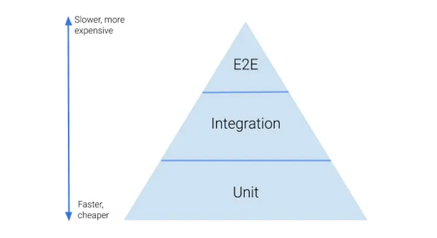
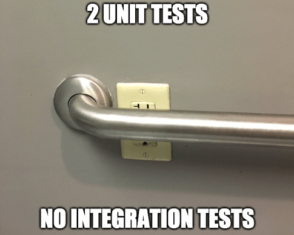
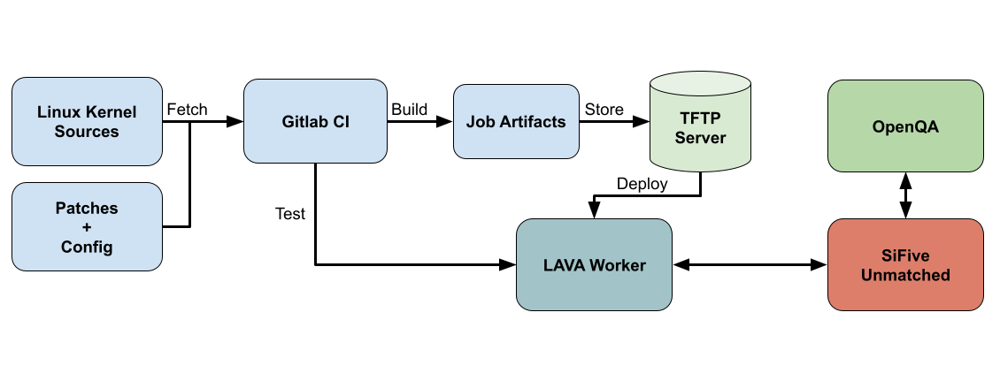

<!--
Automated graphical testing on real hardware: adventures with openQA

https://indico.freedesktop.org/event/4/contributions/215/

XDC 2023 - Wed 18th Oct
20 minutes incl questions

-->

### Automated graphical testing on real hardware: {:.r-fit-text}

## adventures with openQA {:.r-fit-text}

  

  **Sam Thursfield** 
  **XDC 2023**
  

  {:.right style="flex: 1;"}

---

# Hello

I am

 * senior software developer @ Codethink 
 * foundation member and maintainer @ GNOME

---
transition: none-out

???

Mike Cohn's "test pyramid" ("Succeeding with Agile").

  * Unit tests - easy to write; hard to test real usecases (everything outside the unit is "mocked", e.g. connect a USB stick)
  * Integration tests: everything else goes here.
      * "Functional tests", "UI tests", "service tests",...
  * I prefer "end to end testing" over "OS testing"
     * You control every aspect! Via mouse, keyboard, connect a real USB stick...
     * Good coverage of stuff which is difficult with project-specific tests: hardware support, initial setup, session management, font rendering ...
  * Test itself is fast & cheap; but *cycle time* is slow with openQA tests

---
class: invert
transition: none

---

# openQA

Automated end-to-end testing of...

  * **Desktop** operating systems
  * **Phone** operating systems
  * **Car** operating systems
  * ...basically **anything with a screen**

---

## the project

 * Open source (GPL-2.0-or-later)
 * Community-driven development
 * Paid maintainer team (funded by SUSE)

---
class: fs-3

# the tool

 * Strong support for **screenshot testing**
     * Fuzzy region matching (using openCV)
     * Graphical UI for updating screenshots
 * Multiple **backends** for virtual and physical hardware
 * Hackable Perl codebase!

---
transition: slide-in none-out
## How it works

---
transition: none
## How it works
.svg)
---
transition: none
## How it works
.svg)
---
transition: none
## How it works
.svg)
---
transition: none-in slide-out
## How it works
.svg)
---

## Example: GNOME OS tests

Let's try and run them locally...

---

## How this runs in CI

Let's see this online!

GNOME uses Gitlab CI to manage test workers.

---

## The openQA web UI

Let's see this online!

openSUSE use openQA's scheduler to manage test workers.

---

Screenshot tests will always have false positives.
{:.highlight}

openQA deals with this in 4 ways:

  1. Search within the screen
  2. Similarity threshold (90-100%)
  3. Exclude zones
  4. Web UI for needle updates.

---
class: invert
## Integrating with hardware

Testing in QEMU is handy, but how "end-to-end" is it?

Two options:

  1. Flash & boot device, then call openQA
  2. Use openQA "generic machine" backend to flash & boot

---
## Example of LAVA + openQA

See: <http://openqa.qa.codethink.co.uk/>

---

## Example of LAVA + openQA

LAVA script 

???

LAVA runs `python3 /home/ubuntu/run_openqa_test.py`

This contacts openQA server over HTTP to run test and wait for completion.

openQA uses VNC to control device.

---
**Testing on automotive hardware**

Cars don't ship VNC.

Software tools developed at Codethink:

  * Q.A.D.: lightweight "remote control" (alternative to VNC):
    <https://gitlab.com/CodethinkLabs/qad/>
  * QAnvas: needle editing UI
    <https://gitlab.com/CodethinkLabs/qad/>

---
class: invert
## Hardware tools

**USB-C switcher** with computer control

Used for tests involving phones & removable media

**Open hardware**, see: <https://gitlab.com/CodethinkLabs/usb-switch>

???

We also send patches up to openQA

---
class: invert
## Hardware tools

What to do about the mess??

---
class: invert
## Hardware tools

**Testing in a Box**

Hardware: Host PC, serial, CAN emulator, USB Switch + Hub, Bluetooth/WiFi, HID emulation, ...

Software: Gitlab + Gitlab CI, openQA worker, ...

**Open hardware**, see: <https://gitlab.com/CodethinkLabs/testing-in-a-box>

---
class: left
## How to get involved {:.r-fit-text}

openQA:

  * Code: <https://github.com/os-autoinst/>
  {:.fs-3}
  * Chat: Matrix [#openqa:opensuse.org](https://matrix.to/#/#openqa:opensuse.org)
  {:.fs-3}

GNOME openQA tests:

  * Chat: Matrix [#gnome-os:gnome.org](https://app.element.io/#/room/#gnome-os:gnome.org)
  {:.fs-3}

Codethink projects:

  * Code: <https://gitlab.com/CodethinkLabs/>
  {:.fs-3}
  * Chat: Matrix [#codethinklabs:matrix.org](https://matrix.to/#/#codethinklabs:matrix.org)
  {:.fs-3}

  

  **Sam Thursfield** 
  **XDC 2023**
  

  {:.right style="flex: 1;"}

