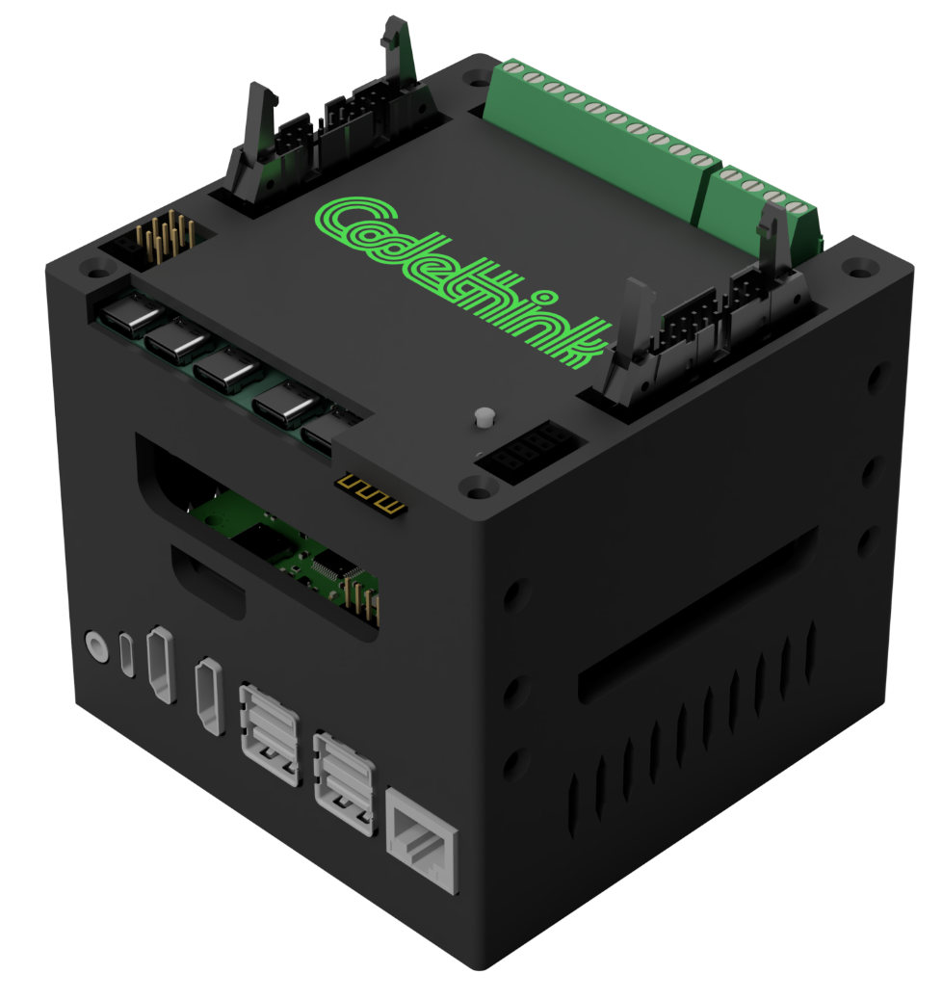

<!--
Automated graphical testing on real hardware: adventures with openQA

https://indico.freedesktop.org/event/4/contributions/215/

XDC 2023 - Wed 18th Oct
20 minutes incl questions

-->

### Automated graphical testing on real hardware: {:.r-fit-text}

## adventures with openQA {:.r-fit-text}

  

  **Sam Thursfield** 
  **XDC 2023**
  

  {:.right style="flex: 1;"}

---

# Hello

I am

 * senior software developer @ Codethink 
 * foundation member and maintainer @ GNOME

---
transition: none-out

???

Mike Cohn's "test pyramid" ("Succeeding with Agile").

  * Unit tests - easy to write; hard to test real usecases (everything outside the unit is "mocked", e.g. connect a USB stick)
  * Integration tests: everything else goes here.
      * "Functional tests", "UI tests", "service tests",...
  * I prefer "end to end testing" over "OS testing"
     * You control every aspect! Via mouse, keyboard, connect a real USB stick...
     * Good coverage of stuff which is difficult with project-specific tests: hardware support, initial setup, session management, font rendering ...
  * Test itself is fast & cheap; but *cycle time* is slow with openQA tests

---
class: invert
transition: none

---

# openQA

Automated end-to-end testing of...

  * **Desktop** operating systems
  * **Phone** operating systems
  * **Car** operating systems
  * ...basically **anything with a screen**

---

## the project

 * Open source (GPL-2.0-or-later)
 * Community-driven development
 * Paid maintainer team (funded by SUSE)
 * "Continous release" model (no "stable" version)

---
class: fs-3

# the tool

 * Strong support for **screenshot testing**
     * Fuzzy region matching (using openCV)
     * Graphical UI for updating screenshots
 * Multiple **backends** for virtual and physical hardware
 * Hackable Perl codebase!

---

## Example: GNOME OS tests

Let's try and run them locally...

    rm -r ./out; env ssam_openqa run --tests-path . \
        --hdd-path ./gnome_os_disk.latest.20230831.img \
        --iso-path ./gnome_os_installer_525758.iso \
        -o ./out

---
class: fs-3

## Running isotovideo container  {:.fs-4}

`ssam_openqa` is a CLI helper tool.
{:.left}

It wraps long Podman commands:
{:.left}

    podman run --name ssam_openqa_gnome_apps \
        --privileged --detach \
        --volume=$(pwd)/gnome_os_disk.latest.20230831.img:/disk.img \
        --volume=$(pwd):/tests \
        --volume=$(pwd)/out/gnome_apps:/shared \
        --entrypoint isotovideo \
        --publish 5990 \
        --publish 20013 \
        -- \
        registry.opensuse.org/devel/openqa/containers15.4/openqa_worker:latest \
        --workdir=/shared ARCH=x86_64 \
        ASSETDIR=/var/lib/openqa/share/factory/ \
        BACKEND=qemu \
        ...

os-autoinst is also packaged in distros - but beware "rolling release" versioning.
{:.left .fs-4}

---
transition: slide-in none-out
## How it works

---
transition: none
## How it works
.svg)
---
transition: none
## How it works
.svg)
---
transition: none
## How it works
.svg)
---
transition: none-in slide-out
## How it works
.svg)
---

## Integrating into CI

Two options:
{:.left}

  * Permanent workers, managed by **openQA server**
  * Transient workers, e.g. on a **Gitlab CI runner**
{:.left}

openSUSE use openQA to manage workers.
{:.left}

GNOME uses transient runners on [Gitlab CI](https://gitlab.gnome.org/GNOME/gnome-build-meta/-/pipelines?page=1&scope=all&ref=master).
{:.left}

---

## The openQA web UI

Let's see this online!

---

Screenshot tests will always have false positives.
{:.highlight}

openQA deals with this in 4 ways:

  1. Search within the screen
  2. Similarity threshold (90-100%)
  3. Exclude zones
  4. Web UI for needle updates.

---
class: invert fs-2
## Beyond QEMU: testing on hardware {:.r-fit-text}

{:.r-stretch}

"Permenant worker" and "transient worker" approaches are possible.
{:.r-fit-text}

---
## Kernel testing at Codethink

???

LAVA runs `python3 /home/ubuntu/run_openqa_test.py`

This contacts openQA server over HTTP to run test and wait for completion.

openQA uses VNC to control device.

---
## Example of LAVA + openQA

See: <http://openqa.qa.codethink.co.uk/>

---
class: invert fs-2
**Testing on automotive hardware**

How do you remote control a car IVI system?

  * <strike>virtio devices</strike>
  * <strike>VNC</strike>
  * <a href="https://gitlab.com/CodethinkLabs/qad/">Q.A.D.</a>: lightweight "remote control" daemon

---
class: invert
## Hardware tools

**USB-C switcher** with computer control

{:.r-stretch}

For tests involving phones & USB media

**Open hardware**, see: <https://gitlab.com/CodethinkLabs/usb-switch>
{:.r-fit-text}

???

We also send patches up to openQA

---
class: invert
## Hardware tools

{:.r-stretch}

What to do about the mess??

---
## Hardware tools

**Testing in a Box**

{:.r-stretch}

Hardware: *Host PC, serial, CAN emulator, USB Switch + Hub, Bluetooth/WiFi, HID emulation, ...*
{:.fs-3}

Software: *Gitlab + Gitlab CI, openQA worker, ...*
{:.fs-3}

**Open hardware**, see: <https://gitlab.com/CodethinkLabs/testing-in-a-box>
{:.fs-3 .r-fit-text}

---
class: left
## Codethink is hiring {:.r-fit-text}

openQA: [https://openqa.qa/](https://open.qa/)

GNOME tests: [https://gitlab.gnome.org/gnome/openqa-tests/](https://gitlab.gnome.org/gnome/openqa-tests)

Codethink projects:

  * Code: [https://gitlab.com/CodethinkLabs/](https://gitlab.com/CodethinkLabs/)
  {:.fs-3}
  * Chat: [#codethinklabs:matrix.org](https://matrix.to/#/#codethinklabs:matrix.org)
  {:.fs-3}

  

  **Sam Thursfield** 
  **XDC 2023**
  

  {:.right style="flex: 1;"}

