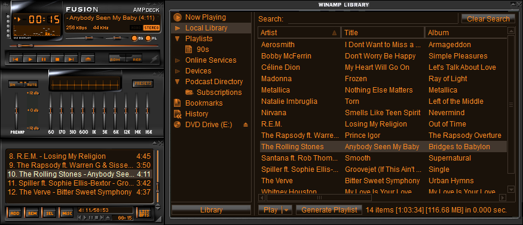
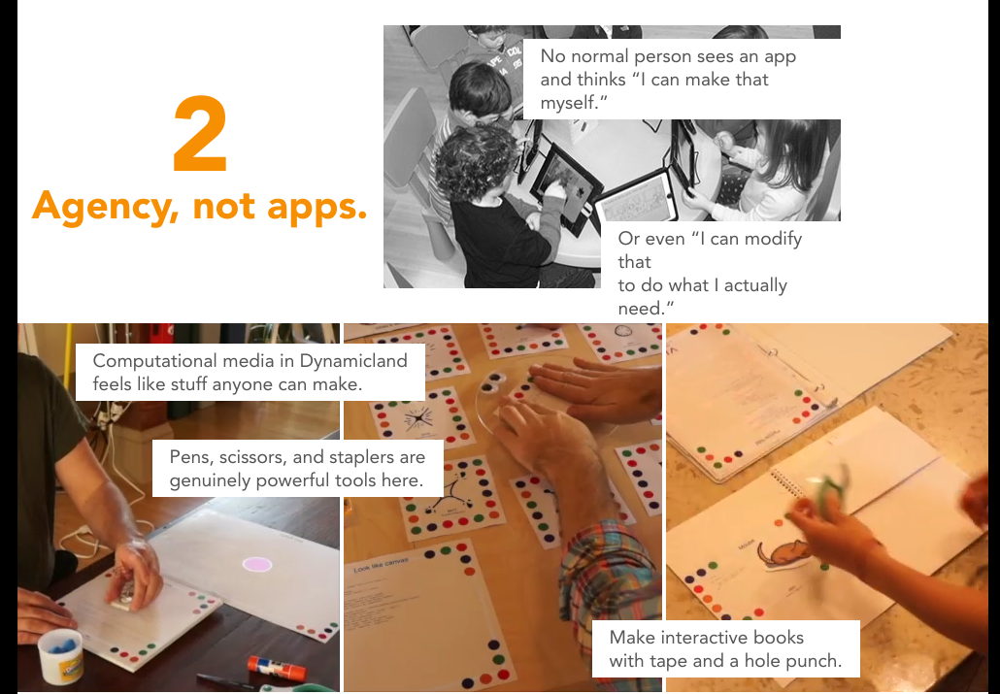
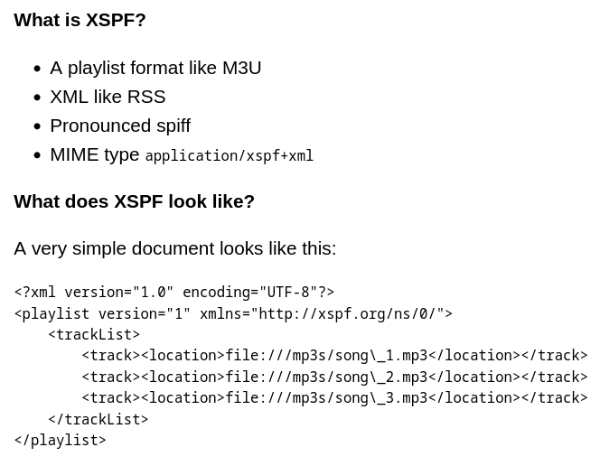
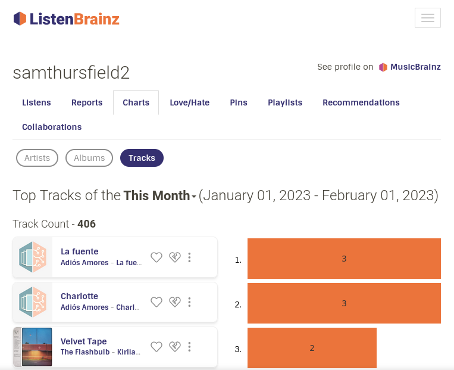
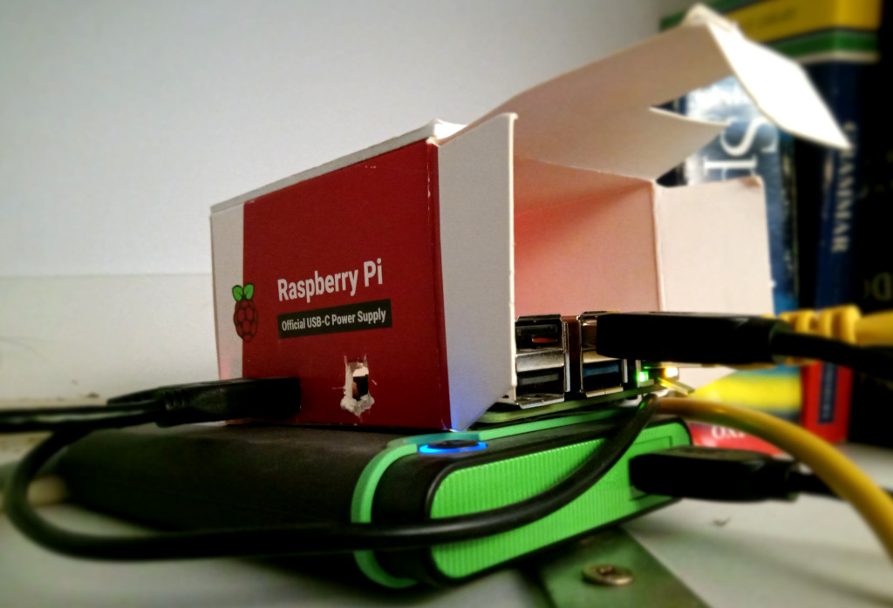

<!--
Simple, open, music recommendations with Python
FOSDEM 2023 - Python Devroom - Sunday 5/Feb 14:00
https://www.fosdem.org/2023/schedule/event/python_music_recommendation/
30 minutes inc. questions and changeover.
-->

## Simple, Open, Music Recommendations with Python

Sam Thursfield

FOSDEM 2023

???

This talk is about:

  * Philosophy
  * Coding
  * Python

---

<!-- 1. Intro / philosophy -->

## About me

<div markdown=1 class="r-stretch">
* Systems software developer @ Codethink

* Musician and music fan

* Former teacher
</div>

???

This is not a "here's some code I wrote, please use it" talk

---

## Playlists (1990s)

{:.r-stretch}

  ❌ Difficult to make

  ✅ Easy to share

Photo: <a href="https://flickr.com/photos/alamodestuff/5833382032/in/photolist-9TtBfh-ftWto-4YEr9j-ftWv6-4YAaUM-9CkP2c-wCKpk-7oFFoZ-jiRWss-Uz92kS-2msKmY4-cwMLy3-6441ZB-NhJ4YR-98j2m8-5XBbab-2ibwsrd-qdGTeD-2caMHPu-oeLk-4getqe-rgvVh-6W2MMf-9CoJsu-s6twGD-qNu6Jw-2nxVHaU-8mipwh-8A4ur-2mG5anP-2mPR2Da-2ipxnUJ-4DEj4Y-2mG3Zv4-5q6tsr-Dvs8g-2bCjKLM-2ibu6X8-mhQ1gJ-2iw3e1o-2iptJPZ-2ibwsvG-LjfuWS-9XbEbE-2mG5a2P-4YAaMR-9CoHGS-4YAaL4-qKmDBv-9kSMDW">Alamodestuff</a>, Flickr, CC-BY-NC-ND
{:.fs-6}

---

## Playlists (2000s)

{:.r-stretch}

  ✅ Easy to make

  ❌ Difficult to share

Photo: <A href="https://www.deviantart.com/ariszlo/art/Fusion-AMPdeck-5-6-556579729">Ariszlo</a>, DeviantArt, CC-BY-NC-SA
{:.fs-6}

???

xmms, rhythmbox

---

## Playlists (2010s)

{:.r-stretch}

  ✅ Easy to make

  ✅ Easy to share

  🤖 Can generate the playlist for you

???

---

# Spotify philosophy {:.r-fit-text}

  * Grow as big as possible ("blitzscaling")
  * Pay artists as little as possible
  * Optimize for passive listener engagement
  * Apply user surveillance and machine-learning to every problem
  * All hail the Algorithm

???

References:

  * BJ videos
  * Algorithm searches
  * ...

---

# What would the opposite look like?

---

  * Not for profit / DIY
  * Encourage building a local music collection
  * Link to artist-controlled websites
  * Work with open data

???

Bandcamp, Patreon
Musicbrainz, Listenbrainz

---

<!-- 2. Fundamentals - open playlists -->

What can we learn from ... **Dynamicland** ?

{:.r-stretch}

---

What can we learn from ... **Dynamicland** ?

<div markdown="1" class="r-stretch">
<div markdown="1" style="display:inline; vertical-align: middle;">
  * Simple, open algorithms (< 1000 lines of Python)
  * Learn and participate in the process
</div>
</div>

---

What can we learn from **Git**?

{:.r-stretch}

???

Git: an incredible DIY project

---

## Git's core ideas were implemented in a month {:.r-fit-text}

  * Well-defined data model: blobs, trees, commits, refs.
  {:.fs-3}
  * Multi-call binary: small programs that work together
  {:.fs-3}
  * "Porcelain" and "Plumbing" layers
  {:.fs-3}

???

https://marc.info/?l=git&m=117254154130732

---

## Git's design allows... {:.r-fit-text}

  * a "polyglot" codebase
  * easy extensions
  * popular websites built around it

???

C, Shell, Perl, TCL
Git LFS
Gitlab, Github

---

**Calliope**: the same principle for playlists.

  * Data model: everything is a playlist
  {:.fs-3}
  * Multi-call binary `cpe`
  {:.fs-3}
  * Build recommendation pipelines as shell pipelines
  {:.fs-3}
  * Python API for more complex work.
  {:.fs-3}
  * Optimized for ease of maintenance over ease of use.
  {:.fs-3}

```pip3 install calliope-music```
{:.fs-3}

???

There is code, but the IDEAS are what i care about ...

i.e this package won't solve all your problems

---

Focus on the commandline, and you can
integrate with any programming tool.

???

Can language-specific tools e.g. jupyter

---

## Core data model

**Playlist item**
{:.left}

```
{ "creator": "Artist 1", "title": "Great Song" }
```

<br>

**Playlist**
{:.left}

```
{ "creator": "Artist 1", "title": "Great Song" }
{ "creator": "Artist 2", "title": "Banging Tune" }
{ "creator": "Artist 3", "title": "Unpleasant Noise" }
```

This is [JSON Lines](https://jsonlines.org/) data so it can be processed one line at a time.
{:.left .fs-4}

---

# ...based on XPSF {:.r-fit-text}

{:.r-stretch}

???

Use XSPF except:

 * one item per line, to allow stream-based processing for long playlists
 * JSON instead of XML

---

## Demo: playlist manipulation {:.r-fit-text}

```
{ "creator": "Artist 1", "title": "Great Song" }
{ "creator": "Artist 2", "title": "Banging Tune" }
{ "creator": "Artist 3", "title": "Unpleasant Noise" }
```

<div class="fs-3 left" markdown="1">
* Shuffle: `cpe shuffle`
* Export: `cpe export`
* Line-based shell processing
* Data-oriented shell processing
</div>

---

# What's next?

---

## Content resolution {:.top}

XPSF is *portable*.
{:.left}

> XSPF is an intermediate format. We expected a new kind of software called a content resolver to do the job of converting XSPF to a plain old list of files or URIs.
{:.fs-4 .left .r-stretch}
>
> -- [XSPF spec](https://xspf.org/spec#34-content-resolver)
{:.fs-4 .left .r-stretch}

---

## Demo: content resolution {:.r-fit-text}

Three songs:
{:.left}

```
{"creator": "Kate Bush", "title": "Hounds of Love"}
{"creator": "Madonna", "title": "Holiday"}
{"creator": "Ana Frango Elétrico", "title": "Saudade"}
```

* Resolve locally: `cpe tracker resolve-content`
{:.left .fs-3}
* Resolve remotely: `cpe spotify resolve-content`
{:.left .fs-3}

---

# What's next?

???

We haven't recommended anything yet.

---

# Recommendations {:.r-fit-text}

big playlist ⟶ process ⟶ small playlist

---

<!-- 3. Case study: special mix -->

# Case study: Special Mix {:.r-fit-text}

**Special Mix** generates a 1 hour playlist of discoveries from a specific year.
{:.left .fs-3}

`python3 -m calliope_examples.special_mix`
{:.fs-4}

<div class="left fs-3" markdown="1">
Ingredients:

  1. Listening history: `pylistenbrainz`
  2. Local music collection: `beets`
  3. Track selection: `simpleai`
  4. Export to music player: `calliope-music`
</div>

---

## 1. Listening history {:.r-fit-text}

<div class="r-fit-text" markdown="1">
  * Use [Listenbrainz](https://listenbrainz.org/) to track music you listen to
  * Use [Web Scrobbler](https://web-scrobbler.com/) browser extension to submit listens
  * Use [pylistenbrainz](https://github.com/metabrainz/pylistenbrainz) and `cpe listenbrainz` to access the data
</div>

{:.r-stretch}

???

Last.fm is also supported - it's an older, proprietary Listenbrainz

Spotify also tracks what you listen to - you can export the data under GDPR, but they dont' make it super easy.

---

## 1. Listening history {:.r-fit-text}

`cpe listenbrainz listens`

```
〉cpe listenbrainz-history --user samthursfield2 listens \
    | from json --objects | first 
Updating listens from Listenbrainz server  [####################################]  100%          
╭─────────────────────────────┬──────────────────────────────────────────╮
│ listenbrainz.listened_at    │ 1675368832                               │
│ listenbrainz.recording_msid │ 306525cd-74d3-4acb-b292-8bf300ba6040     │
│ listenbrainz.artist_msid    │                                          │
│ listenbrainz.release_msid   │                                          │
│ creator                     │ Knobs                                    │
│ title                       │ WIW                                      │
│ album                       │ Stipple                                  │
│ listenbrainz.origin_url     │ https://knobs.bandcamp.com/album/stipple │
╰─────────────────────────────┴──────────────────────────────────────────╯
```

???

The great thing of using Python, is *every* API has an existing Python binding

However, some are not well maintained... so we vendor them.

Syncing the data takes a while

---

## 1. Listening history {:.r-fit-text}

```
〉cpe listenbrainz-history --no-sync --user samthursfield2 \
     histogram --bucket year | from json  | last 5
╭───┬─────────────────────┬───────╮
│ # │       bucket        │ count │
├───┼─────────────────────┼───────┤
│ 0 │ 2019-01-01 00:00:00 │  6014 │
│ 1 │ 2020-01-01 00:00:00 │  5990 │
│ 2 │ 2021-01-01 00:00:00 │  4239 │
│ 3 │ 2022-01-01 00:00:00 │  6721 │
│ 4 │ 2023-01-01 00:00:00 │   208 │
╰───┴─────────────────────┴───────╯
```

The `listenbrainz.listens` module is: 799 lines of Python.
{:.r-fit-text}

???

---

## 2. Local music collection {:.r-fit-text}

{:.r-stretch}

---

## 2. Local music collection {:.r-fit-text}

**Beets** is the media library management system for obsessive music geeks.

<div class="r-stretch">
<div style="font-family: Arial; font-size: 14px;"><pre>&gt; <b>beet</b>&nbsp;<font color="#0AAEB3">import</font>&nbsp;<font color="#0AAEB3"><u style="text-decoration-style:single">CD</u></font><font color="#FED06E"><u style="text-decoration-style:single"><b>\ </b></u></font><font color="#0AAEB3"><u style="text-decoration-style:single">Recopilatorio/</u></font>&nbsp;<font color="#0AAEB3"><u style="text-decoration-style:single">The</u></font><font color="#FED06E"><u style="text-decoration-style:single"><b>\ </b></u></font><font color="#0AAEB3"><u style="text-decoration-style:single">Autonomads</u></font><font color="#FED06E"><u style="text-decoration-style:single"><b>\ </b></u></font><font color="#0AAEB3"><u style="text-decoration-style:single">-</u></font><font color="#FED06E"><u style="text-decoration-style:single"><b>\ </b></u></font><font color="#0AAEB3"><u style="text-decoration-style:single">2009</u></font><font color="#FED06E"><u style="text-decoration-style:single"><b>\ </b></u></font><font color="#0AAEB3"><u style="text-decoration-style:single">-</u></font><font color="#FED06E"><u style="text-decoration-style:single"><b>\ </b></u></font><font color="#0AAEB3"><u style="text-decoration-style:single">No</u></font><font color="#FED06E"><u style="text-decoration-style:single"><b>\ </b></u></font><font color="#0AAEB3"><u style="text-decoration-style:single">Mans</u></font><font color="#FED06E"><u style="text-decoration-style:single"><b>\ </b></u></font><font color="#0AAEB3"><u style="text-decoration-style:single">Land/</u></font>&nbsp;<font color="#0AAEB3"><u style="text-decoration-style:single">the</u></font><font color="#FED06E"><u style="text-decoration-style:single"><b>\ </b></u></font><font color="#0AAEB3"><u style="text-decoration-style:single">autonomads</u></font><font color="#FED06E"><u style="text-decoration-style:single"><b>\ </b></u></font><font color="#0AAEB3"><u style="text-decoration-style:single">+</u></font><font color="#FED06E"><u style="text-decoration-style:single"><b>\ </b></u></font><font color="#0AAEB3"><u style="text-decoration-style:single">black</u></font><font color="#FED06E"><u style="text-decoration-style:single"><b>\ </b></u></font><font color="#0AAEB3"><u style="text-decoration-style:single">star</u></font><font color="#FED06E"><u style="text-decoration-style:single"><b>\ </b></u></font><font color="#0AAEB3"><u style="text-decoration-style:single">dub</u></font><font color="#FED06E"><u style="text-decoration-style:single"><b>\ </b></u></font><font color="#0AAEB3"><u style="text-decoration-style:single">collective/</u></font>

/home/sam/Music/The Autonomads - 2009 - No Mans Land (9 items)
Correcting tags from:
&nbsp; &nbsp; <font color="#FF3128"><b>The </b></font>Autonomads - No Mans Land
To:
&nbsp; &nbsp; Autonomads - No Mans Land
URL:
&nbsp; &nbsp; https://musicbrainz.org/release/58350fe5-4a9d-48fe-9fbd-434378b1728f
(Similarity: <font color="#519F50"><b>97.8%</b></font>) <font color="#FBB829"><b>(tracks, artist)</b></font>&nbsp;<font color="#918175">(Digital Media, 2012, GB, [none])</font>
&nbsp;* Foot <font color="#918175">I</font>n Mouth &nbsp; &nbsp; &nbsp; &nbsp; &nbsp; -&gt; Foot <font color="#918175">i</font>n Mouth
&nbsp;* Dubbin' Up <font color="#918175">T</font>he Downfall -&gt; Dubbin' Up <font color="#918175">t</font>he Downfall
&nbsp;* Back <font color="#918175">T</font>o <font color="#918175">T</font>he Bark &nbsp; &nbsp; &nbsp; &nbsp;-&gt; Back <font color="#918175">t</font>o <font color="#918175">t</font>he Bark
&nbsp;* <font color="#FF3128"><b>R</b></font>o<font color="#FF3128"><b>lling</b></font>&nbsp; &nbsp; &nbsp; &nbsp; &nbsp; &nbsp; &nbsp; &nbsp; &nbsp;-&gt; <font color="#FF3128"><b>M</b></font>o<font color="#FF3128"><b>tordread</b></font>&nbsp;<font color="#FBB829"><b>(title)</b></font>
</pre><br></div>
</div>

<https://beets.io/>
{:.fs-4}

There could be a beets content resolver... ([issue 107](https://gitlab.com/samthursfield/calliope/-/issues/107))

???

Pure Python, imports music you buy and download and organizes tags etc. - great.

---

## 2. Local music collection {:.r-fit-text}

... but for now I use `cpe tracker resolve-content`.

Special Mix can use any content resolver, in theory.

???

Tracker is an indexer used by GNOME, it's out of scope of this talk but an easy way to index large music collection.

Content resolvers are 'pluggable':

```
def available_content_resolvers() -> List[ContentResolver]:
    """List of available classes supporting a `resolve_content` method.

    The list is:

      * :class:`calliope.spotify.SpotifyContext`
      * :class:`calliope.tracker.TrackerClient`

    """
    result = dict()
    if _module_is_available(spotify):
        result["spotify"] = spotify.SpotifyContext
    if _module_is_available(tracker):
        result["tracker"] = tracker.TrackerClient
    return result
```

---


cpe select

---

cpe export

---

<!-- 4. Ideas -->

 * Use in teaching
 * Musicbrainz popup app
 * GUI apps
 * Websites

---

# Discussion
